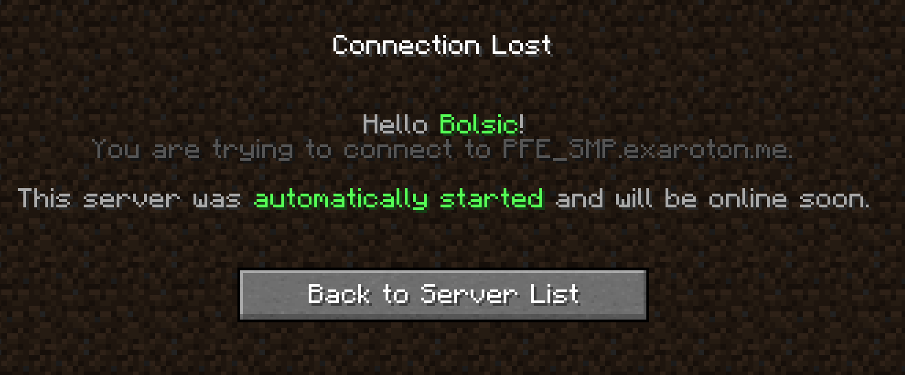

# PFE-SMP

## Šta se ovde nalazi?

Ovde se nalaze fajlovi potrebni za pokretanje PFE-SMP servera. Neki od modova su obavezni dok su neki _client side_ modovi. Stavio sam oba kao neku preporuku šta ja koristim. Možete dodavati _client side_ modova kolko želite. Što se tiče običnih modova morate imati tačo one modove koji su i na serveru. 

## Instalacija

Nakon instaliranja [TLauncher](https://tlauncher.org/en/)-a ili bilo kog drugog Minecraft _launcher-a_ (predlažem TLauncher jer možete namestiti svoj username, umesto da se zovete nešto random) unutar "**.minecraft**" foldera, kom možete pristupiti iz TLauncher-a ili kroz file menager, naćićete "**mods**" i "**resourcepacks**" foldere. Ubacite sadržaj istoimenih foldera sa ovog repozitorijuma u pronadjene foldere i tjt.  
   ***DISCLAIMER: Ako ne nadjete neki od navedenih foldera možda je potrebno da jednom pokrnete minecraft bez ikakvih dodataka da bi se generisali.***

Ako nekad dodje do promena modova ovaj repozitorijum će biti adekvatno ažuriran.

## Pristup serveru

Na server se pristupa preko sledeće IP adrese: 
 PFE_SMP.exaroton.me:16390     
Ako je server ugašen kada pokušate da pristupite na njega dobićete sledeću poruku:

Server će se nakon par minuta uključiti i moći ćete da pristupite.

## Gameplay

Difficulty: Hard    
Gamemode: Survival (fiksirano)   
PVP: Enabled    
RAM Servera: 6 GB (promenljivo)    

### Pravila servera

 TODO: 

Bilo bi lepo kada bismo se dogovorili oko ovoga

Krađa:      
Uništavanje stvari:      
Prodavnice (npr. prodajem 64 gvožđa za dijamant i verujem da niko neće samo da ukrade):     
Random ubijanja:      
***. . .***

## Modovi

### Dependency Modovi

Ovi modovi su potrebni da bi drugi modovi radili

| Name                    |
|-------------------------|  
|Architectury             |
| Ash API                 |  
| Cloth Config            |  
| Fabric API              |
| Fabric Language Kotlin  | 
| LibPIN                  |
| MaLiLib                 |
| Reeses Sodium Options   |
| Sodium Extra            |

### Client Side Modovi
 
 Ovi modovi nisu obavezni, niti morate da imate baš ove.

 | Name                    | Description                                                        |
|-------------------------|--------------------------------------------------------------------|
| Better F3               | Customisable F3 menu                                               |
| Entity Model Features   | Allows the usage of Better Animations resourcepack                 |
| Entity Texture Features | Allows the usage of Better Animations resourcepack                 |
| Just Enaugh Items | A simple menu of all the items in the game and their recepies      |
| LambDynamicLights     | Dynamic lights 
| Light Overlay           | A simple overlay that shows the light leve of blocks               |
| Litematica              | [LINK](https://www.curseforge.com/minecraft/mc-mods/litematica)                                                               |
| Mod Menu                | A mod menu at the title screen                                     |
| Shuffle                 | Randomise block placement for better building                      |
| WI Zoom                 | Zoom                                                               |

### Performance Modovi

Neki od ovih modova nisu obavezni, neki jesu. Nisam više siguran koji su koji. Samo ih zadržite sve. Svi poboljšavaju performance nekog dela igrice ili celinu igrice. 

| Name             |
|------------------|
| Immediately Fast |
| Indium           |
| Lithium          |
| Sodium           |

### Obavezni modovi

Ovi modovi menjaju kako igrica funkcioniše. Pošto igramo vanila stavio sam modove koji ne ruše vanilla feel, samo poboljšavaju neke sitnice. Ove modove morate imati lokalno da biste pristupili serveru.

| Name                    | Description                                                  |
|-------------------------|--------------------------------------------------------------|
| Clumps                  | Sabija više XP govanca u jedno - smanjuje lag                |
| Freecam                 | Dozvoljava da se kamera odvoji od tela                       |
| Inventory Profiles Next | Sortiranje inventara i još neke sitnice.                     |
| Natures Compass         | Poseban kompas kojim načaziš biome                           |
| River Redux             | Poboljšava generaciju reka                                   |
| Terra Blender           | Poboljšava blend bioma. Takodje je dependency za River Redux |
| Simple Voice Chat       | Proximity chat.                                              |

